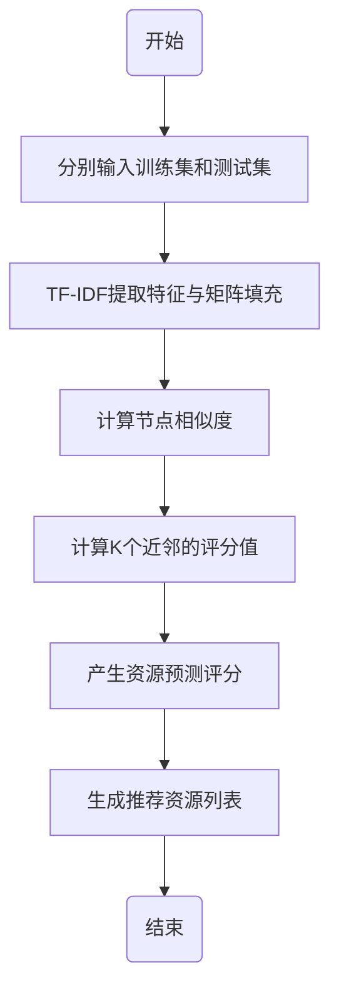

```mermaid
graph TD;
    id1(开始)-->分别输入训练集和测试集;
    分别输入训练集和测试集-->TF-IDF提取特征与矩阵填充;
    TF-IDF提取特征与矩阵填充-->计算节点相似度;
    计算节点相似度-->计算K个近邻的评分值;
    计算K个近邻的评分值-->产生资源预测评分;
    产生资源预测评分-->生成推荐资源列表;
    生成推荐资源列表-->id2(结束);
```
